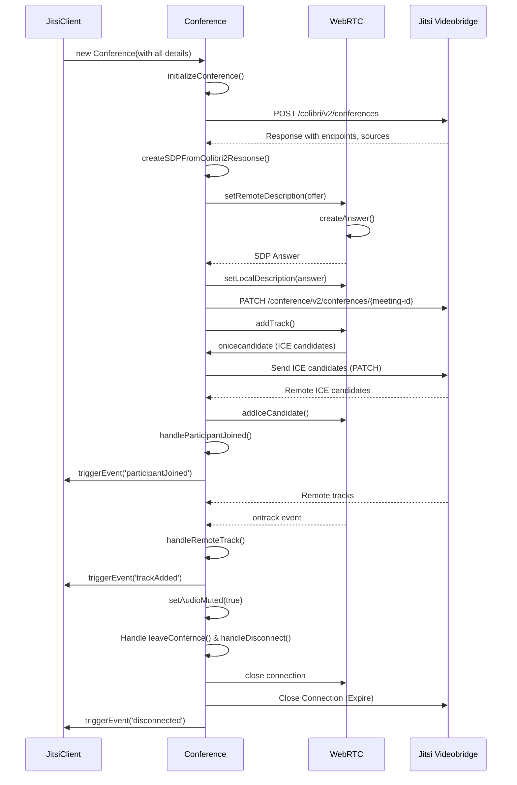

Edit : `Status: Not working`

> I tried to send the all configuration details what described in the test, to post enpoint `colibri/v2/conferences` and then i get the response i take that response convert into the `SDP` using the `sdp-transform` and then i done the `setRemoteDescription` , created answer from client side set it into the `setLocalDescription` and also sending this at some other endpoints to colibri2

https://github.com/user-attachments/assets/2406dd04-18b6-48f6-b422-b1d5d4abdd8d

> This is the rough flow-diagram for the jvb-js 

