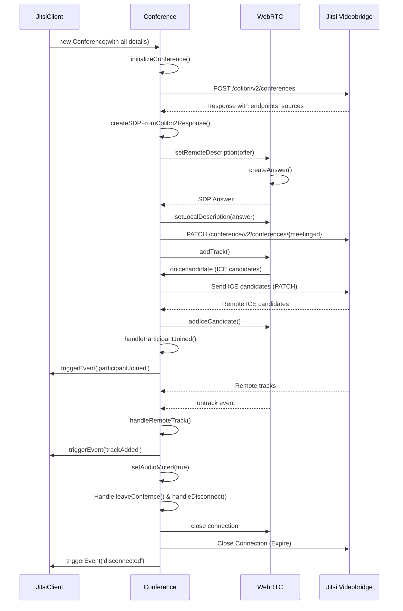

```mermaid
sequenceDiagram
    participant JitsiClient
    participant Conference
    participant WebRTC
    participant Jitsi Videobridge

    JitsiClient->>Conference: new Conference(with all details)
    Conference->>Conference: initializeConference()
    Conference->>Jitsi Videobridge: POST /colibri/v2/conferences
    Jitsi Videobridge-->>Conference: Response with endpoints, sources
    Conference->>Conference: createSDPFromColibri2Response()
    Conference->>WebRTC: setRemoteDescription(offer)
    WebRTC->>WebRTC: createAnswer()
    WebRTC-->>Conference: SDP Answer
    Conference->>WebRTC: setLocalDescription(answer)
    Conference->>Jitsi Videobridge: PATCH /conference/v2/conferences/{meeting-id}

    Conference->>WebRTC: addTrack()
    WebRTC->>Conference: onicecandidate (ICE candidates)
    Conference->>Jitsi Videobridge: Send ICE candidates (PATCH)
    Jitsi Videobridge-->>Conference: Remote ICE candidates
    Conference->>WebRTC: addIceCandidate()
    
    Conference->>Conference: handleParticipantJoined()
    Conference->>JitsiClient: triggerEvent('participantJoined')

    Jitsi Videobridge-->>Conference: Remote tracks
    WebRTC-->>Conference: ontrack event
    Conference->>Conference: handleRemoteTrack()
    Conference->>JitsiClient: triggerEvent('trackAdded')

    Conference->>Conference: setAudioMuted(true)

    Conference->>Conference: Handle leaveConfernce() & handleDisconnect()
    Conference->>WebRTC: close connection
    Conference->>Jitsi Videobridge: Close Connection (Expire)
    Conference->>JitsiClient: triggerEvent('disconnected')
```